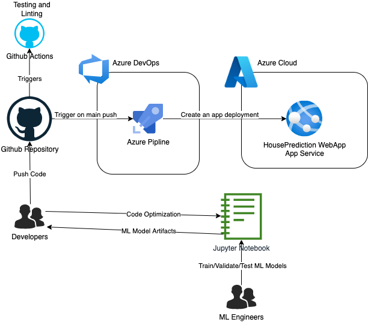
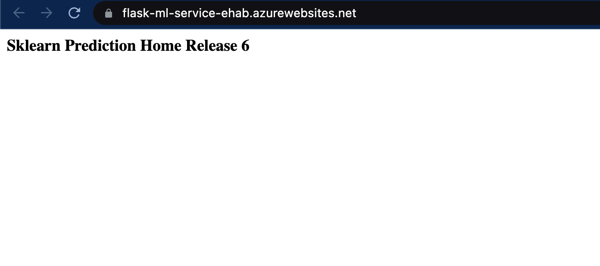
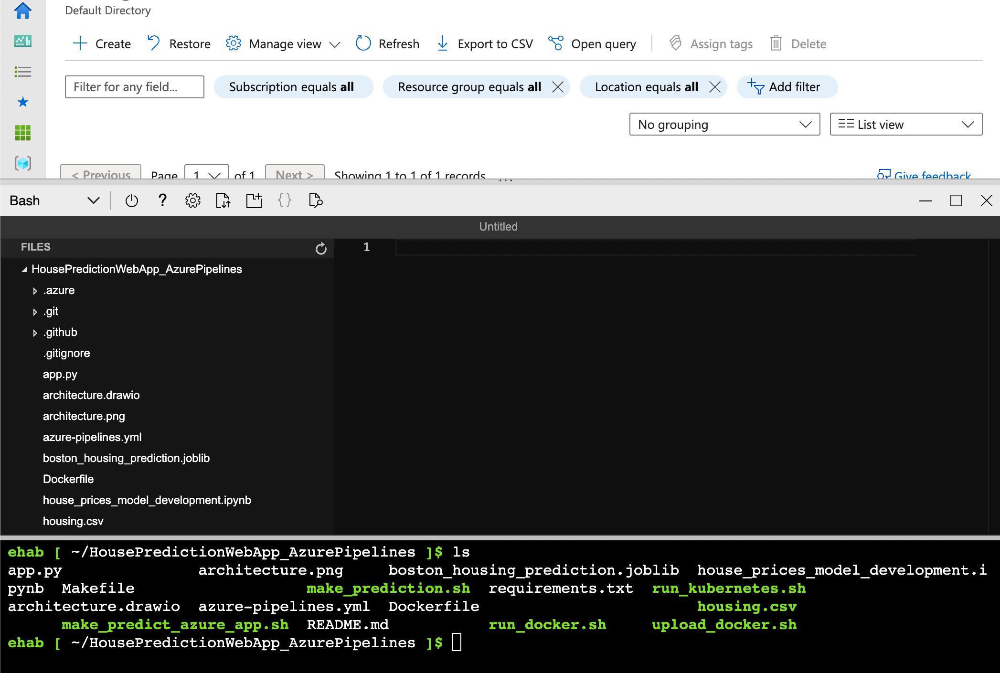
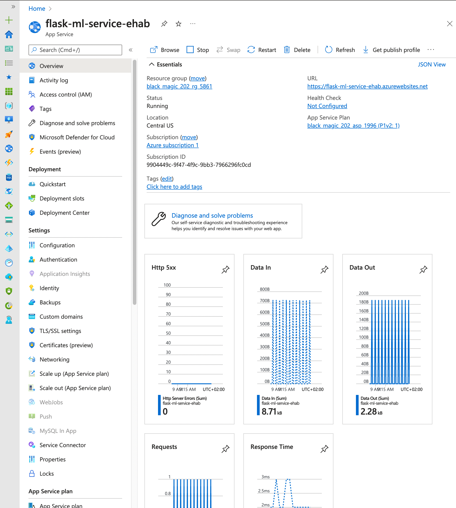
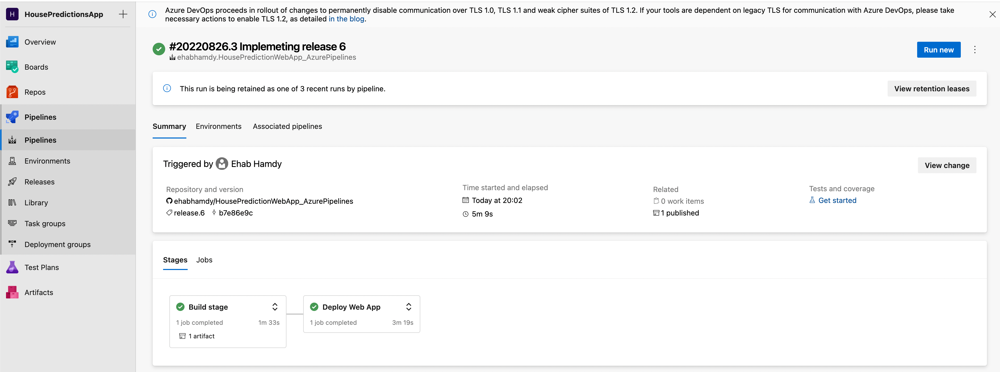
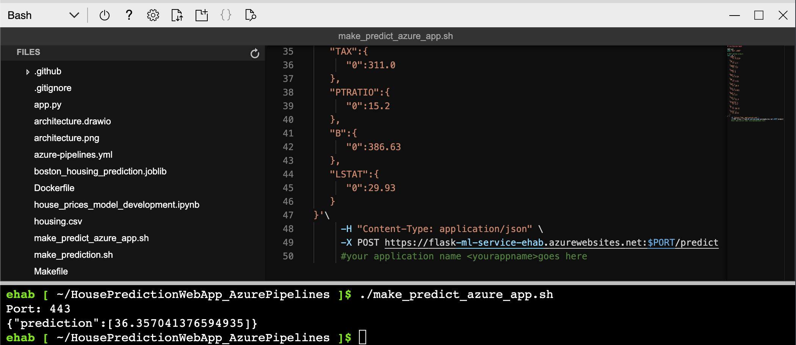
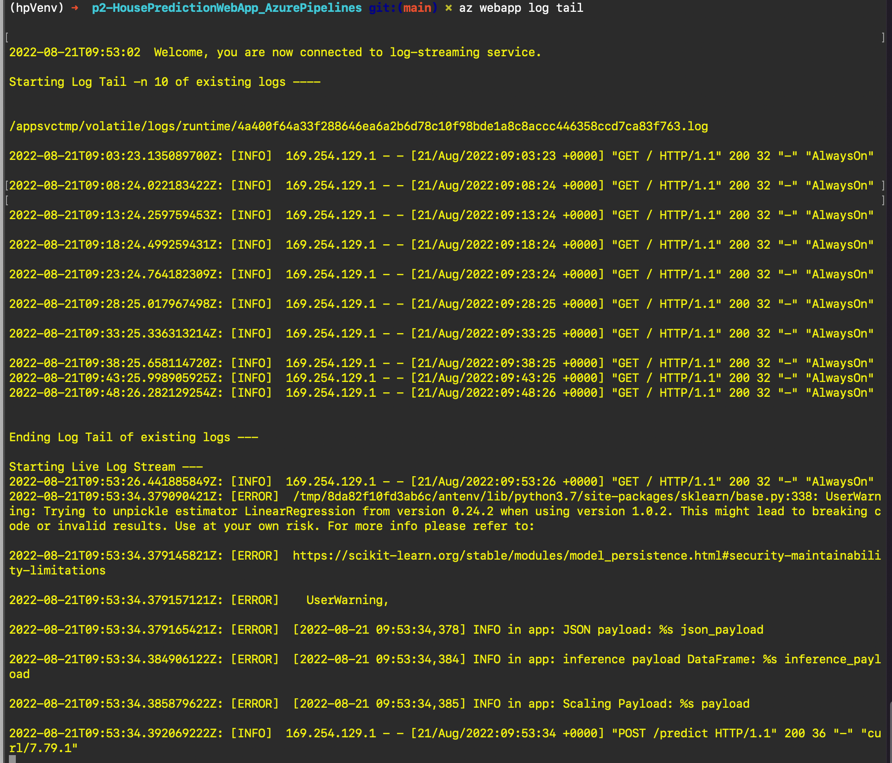

# Overview
This project is done is accordance to the udacity specifications to build a complete CI/CD for a flask based application
that provide a inference endpoint for house price predictions based on the features of the house. The application is 
deployed as a web app on Azure using (Azure App Services). 

## Project Plan
* Trello board for the project:
    https://trello.com/b/5i2rmPGT/housepredictions-of-project-management-template
* Full project plan spreadsheet:
    https://docs.google.com/spreadsheets/d/1fb1SpfHJbU5I71yWouwonHabAM7OO0xeGj4jpk9s6sU/edit?usp=sharing

## Instructions

After cloning the project, you need to perform the following steps to deploy it to azure:
1. Install azure CLI.
2. Login to your azure account `azure login`
3. Deploy the app to Azure App Services: 
`az webapp up -g houseprediction-rg -p house-prediction-service-plan -n house-prediction-app -l westeurope --sku B1 --runtime PYTHON:3.9`
4. For automatic deployment, configure azure DevOps, create a new pipeline and make sure to add a Service Connection
to the deployed Azure App Services app.
5. Make sure to select the pipeline configuration file from the code repository `azure-pipelines.yml`
6. To publish a new release, you need to give your commit a tag for the azure pipeline to trigger a new deployment
Here is an example
`git add .`
`git commit -m "Release 4 implementation"`
`git tag release.4`
`git push`
`git `push origin release.4
7. Once the code is pushed, Github action will trigger the necessary tests and Azure pipeline will perform
a new deployment.

* Architectural Diagram 

* Project running on Azure App Service

* Project cloned into Azure Cloud Shell

* Output of a test run

* Successful deploy of the project in Azure Pipelines. 

* Running Azure App Service from Azure Pipelines automatic deployment

* Successful prediction from deployed flask app in Azure Cloud Shell.

* Output of streamed log files from deployed application

## Enhancements

From a devops engineer prespective, I would definitly consider using infrastructure as code
such as Terraform to deploy the web app instead of the CLI. Developers should avoid working
on the main branch and use [git flow](http://danielkummer.github.io/git-flow-cheatsheet/) 
for better repo organziation. I would also suggest using three different environment for 
development, staging and production.

## Demo

https://youtu.be/OgvBDEV1zYs
